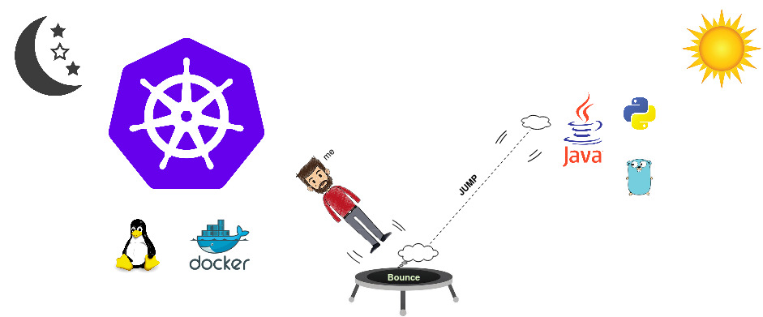

### kubectl get profile vijaysamanuri

```yaml
kind: Profile
apiVersion: vijaysamanuri.io/v1alpha2
metadata: 
  name: vijaysamanuri
  labels:
    cloud: true
    microservices: true
spec:
  firstName: "VijayRamaRaju"
  lastName: "Samanuri"
  currentRole: "Software Architect"
  company: "Pramati Technologies"
  location: "Hyderabad, India"
  linkedIn: www.linkedin.com/in/vijayramaraju
  twitter: https://twitter.com/vijayrrsamanuri
  website: https://vijaysamanuri.github.io/
  projects:
  - name: HyScale
    website: https://www.hyscale.io/
    projectLink: https://github.com/hyscale/hyscale/
  - name: WaveMaker
    website: https://www.wavemaker.com/
   ...
```


<!--
**vijaySamanuri/vijaysamanuri** is a ✨ _special_ ✨ repository because its `README.md` (this file) appears on your GitHub profile.

Here are some ideas to get you started:

- 🔭 I’m currently working on ...
- 🌱 I’m currently learning ...
- 👯 I’m looking to collaborate on ...
- 🤔 I’m looking for help with ...
- 💬 Ask me about ...
- 📫 How to reach me: ...
- 😄 Pronouns: ...
- ⚡ Fun fact: ...
-->
